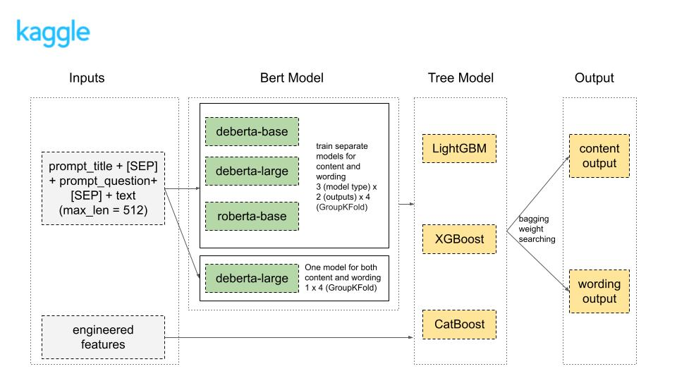
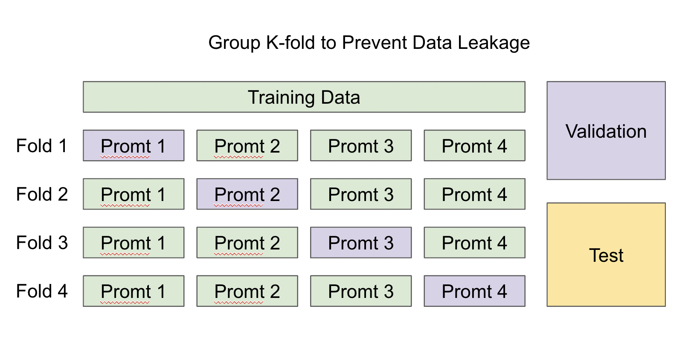

# Kaggle-Commonlit-NLP-2023

## Summary
The objective of this Kaggle competition was to develop a robust and accurate model for summary evaluation prediction. Our team achieved 68/2060 (Silver Medal) by harnessing the power of multiple BERT-based models and tree-based models in an Stacking + Bagging ensemble approach.

BERT-based models: 
* Roberta-base
* DeBERTa-base
* DeBERTa-large

Tree-based models:
* LightGBM
* XGBoost
* CatBoost

The ensemble methodology followed these key steps:

BERT-based Model Integration: We employed multiple pre-trained BERT-based models to extract meaningful representations from the text data. By combining the outputs of these models, we aimed to capture diverse linguistic nuances and improve the model's generalization capability.

Tree-based Models: After obtaining BERT-based embeddings and combining them with the engineered features, we fed the resulting feature set into various tree-based models (Stacking), including LightGBM, XGBoost, and CatBoost. To create the final predictions, we employed an bagging strategy that considered the outputs of different tree models. Weights of tree model outputs are automatically searched using Sequential Least SQuares Programming optimizer (SLSQP). 

Pipeline:

## Feature Engineering
* Advanced words: We generated a variety of count-based features using Wikipedia's word count data ([dataset link](https://www.kaggle.com/datasets/yihuangds/wordfreq-for-nlp-en)), in order to improve wording score
* Num of stopwords
* Num of ngrams
* Num of quotes
* Num of parts of speech (POS)
* Overlap with prompt text

## Model Training

We trained our BERT-based models using various resources, and we find that VastAI is the optimal choice, especially when we lack access to high-powered local GPUs.
* Local 3080 GPU: I purchased a local GPU primarily for gaming in the beginning, but I've tried using it for model training as well. However, it's not sufficient for models like DeBERTa-large, and it can only handle base models with small batch sizes.
* Google Cloud Platform (GCP) with 2 V100 GPUs: I'm unsure why the training process on GCP seems extremely slow, it gets stuck for a long periods between steps. After I successfully trained a model, I had to avoid using it due to this issue.
* Vast AI: Currently, I find that Vast AI offers one of the most effective ways to train models. I've been renting different servers with multiple GPUs (e.g. 4 x 4090) and storing the models on Dropbox.

The initial dataset comprises four prompt questions/texts, and we employed group k-fold cross-validation to train our model.

## Not Working Ideas
* Ratio features
* Text cleaning
* Ratio features
* Embedding as inputs

## Learnings From Top Solutions
* Bert input text prompt engineering
* ...

